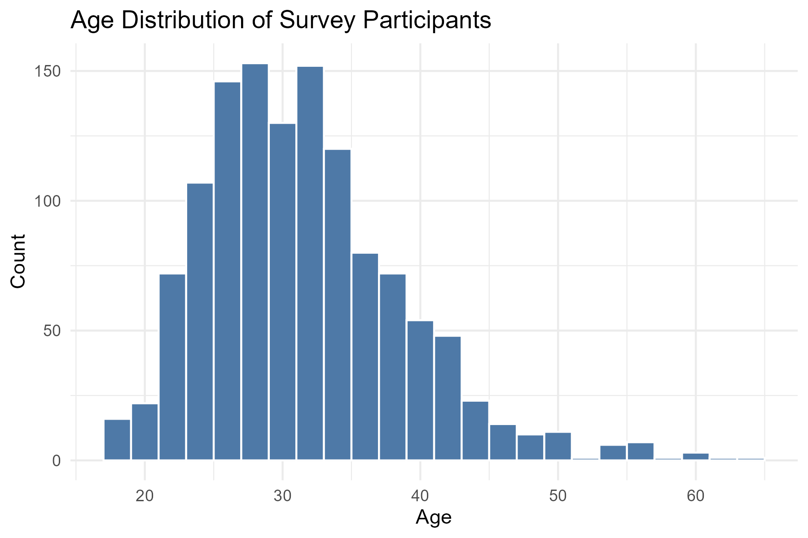

# 🧠 Mental Health in Tech Industry (R Analysis)

This project analyzes mental health trends among tech workers using a public survey dataset. The goal is to explore patterns, identify at-risk groups, and understand factors influencing mental health support in workplaces.

---

## 📊 Dataset
- **Source**: [OSMI Mental Health in Tech Survey](https://www.kaggle.com/datasets/osmi/mental-health-in-tech-survey)
- **Format**: CSV, ~1200 responses
- **Features**: Gender, age, family history, employer support, remote work, mental health status

---

## 📌 Objectives
- Clean and prepare the dataset
- Explore mental health trends by gender, age, and remote work
- Use chi-square tests for categorical variables
- Build a logistic regression model to predict if someone sought treatment

---

## 🛠 Tools Used
- R (`tidyverse`, `ggplot2`, `dplyr`)
- Statistical tests (Chi-square, logistic regression)
- RMarkdown for reporting

---
## 📑 Table of Contents
- [Project Overview](#project-overview)
- [Visualizations](#visualizations)
- [Statistical Tests](#statistical-tests)
- [Logistic Regression](#logistic-regression)
- [View Full Report](#view-full-report)
- [Key Insights](#key-insights)
---

## 📁 Project Structure
mental-health-tech-survey-R/
├── data/
│   └── mental-health-tech-survey.csv
├── scripts/
│   └── analysis.R
├── outputs/
│   └── plots/
├── mental-health-report.Rmd
├── mental-health-report.html
├── README.md

---

## 🔎 Key Analysis
- Data cleaning and standardization (e.g., gender normalization)
- Exploratory Data Analysis with `ggplot2`
- Chi-Square Tests for association
- Logistic Regression to predict treatment-seeking behavior

---

## 📈 Sample Visual

---

## 📄 View Full Report (Live)
👉 [Click here to view the full interactive HTML report](https://ankita-pichuka.github.io/mental-health-tech-survey-R/mental-health-report.html)

---

## ✅ Key Insights
- Individuals with a **family history of mental illness** are significantly more likely to seek treatment.
- Gender has a statistically significant relationship with treatment-seeking.
- Remote work does **not** show a strong relationship with treatment behavior.

---

## 🛠 Tools Used
- R (tidyverse, ggplot2, janitor, glm)
- RMarkdown for documentation
- Git & GitHub for version control

---

## 🙋‍♀️ Author
**Ankita Pichuka**  
Graduate Student – Analytics, Northeastern University  
[LinkedIn](https://www.linkedin.com/in/ankita-pichuka/)

